

JBookTrader

User Guide

 

 

 

 

 

Last Updated: Tuesday, November 1, 2011

Eugene Kononov, Martin Koistinen, Allen Whitt&Shaggs

* * *

Disclaimer

This SOFTWARE PRODUCT is provided “as is” and “with all faults and defects.” The AUTHORS express no warranties of any kind, and claim no responsibility for events resulting directly or indirectly from the use of the SOFTWARE PRODUCT. As with any software, there are inherent risks resulting from the use of the SOFTWARE PRODUCT, 3rd party libraries, operating systems, and the hardware they run on. Trading of financial securities also bears significant risk including factors related to the exchanges, brokerages, and electronic communications between all parties. These risks are magnified by the use of margin and financial derivative products. It is the responsibility of the END USER to review the provided source code and third party software to determine if the system is safe, and to adequately test the system. It is the END USER who must evaluate all risks of the SOFTWARE PRODUCT, and it is the END USER who must bear all risks resulting from the use of the SOFTWARE PRODUCT. It is assumed the END USER is an experienced computer programmer, and can evaluate the provided source code. The AUTHORS are not responsible for any loss of data, wealth, time, or anything else of value from the use, modification, or distribution of the SOFTWARE PRODUCT.

This USERS MANUAL is provided only to familiarize the user with the capabilities of the software, and is provided “as is” and “with all faults, inaccuracies, and defects.” This USERS MANUAL does not mention all risks involved, and is not meant as a guide to influence decisions relating to the purchase or sale of financial securities. It is expected that the END USER is an experienced trader of financial securities, and the END USER will use the SOFTWARE PRODUCT as a tool to facilitate the END USER’s personal trading decisions.

* * *

Table of Contents 

1.  [Summary](#h.b82a0a152313)
2.  [System Requirements](#h.bb7269a4cd0e)
3.  [Installation](#h.7d0469bddc4a)
4.  [Running JBookTrader](#h.e9373dd0e793)
5.  [JBookTrader Operations](#h.5ca0e8cd8703)
6.  [Market Data Display](#h.fa12f5f3a5a9)
7.  [Strategy Running Modes](#h.a50b210d2d7f)
8.  [Back Testing](#h.3c2d85303ed2)
9.  [Forward Testing](#h.4929de0b2c6c)
10.  [Using simulated TWS Account](#h.06f1e27ba9e0)
11.  [Strategy Optimization](#h.71e323ae64bf)

1.  [Optimization Options](#h.df909c9ca6dc)

1.  [Historical Data](#h.97af3f6bcf4c)
2.  [Search Method](#h.eb49877327c0)
3.  [Selection Criteria](#h.6dd652d5b7c5)
4.  [Minimum Trades](#h.0b28add53eaa)

1.  [Optimization Maps](#h.803406a19b65)

1.  [Horizontal](#h.29f72512f54d)
2.  [Vertical](#h.c56b5e084647)
3.  [Case](#h.759d79ae7106)
4.  [Color Map](#h.7bdbb5de44d4)

1.  [Strategy Performance Chart](#h.0375f4323dd3)
2.  [Strategy Performance Evaluation](#h.86022322dc44)

1.  [Trades](#h.4044345b7d79)
2.  [Percent Profitable](#h.190faa03216e)
3.  [Average Trade](#h.fc9632ad7718)
4.  [Net Profit](#h.47778467a7a0)
5.  [Max DD](#h.719605c9f99a)
6.  [Profit Factor](#h.ebc4be1e89c2)
7.  [Kelly](#h.c31171f63f6c)
8.  [Performance Index](#h.0878454bb3bd)

1.  [Recording Market Data](#h.f313887d57c6)
2.  [Trading](#h.a075381d30d9)
3.  [Reporting](#h.b7de96489066)
4.  [Preferences](#h.fdef34383d9a)

1.  [TWS Connection](#h.70ded2d8f2da)
2.  [Web Access](#h.2010a80a07bf)
3.  [Look & Feel](#h.bebdd4eab0af)

1.  [Adding your own trading strategy](#h.2ef9c361df37)
2.  [Literature](#h.2f3cf59eacdd)
3.  [Technical Support](#h.a1fbba1803f1)

#  

* * *

Summary

JBookTrader is a fully automated trading system (ATS) that can trade various types of market securities during the trading day without user monitoring. All aspects of trading, such as obtaining prices, analyzing price patterns, making trading decisions, placing orders, monitoring order executions, and controlling the risk are automated according to the user preferences. The central idea behind JBookTrader is to completely remove the emotions from trading, so that the trading system can systematically and consistently follow a predefined set of trading and risk management rules.

The features include strategy back testing, strategy optimization, intra-day data retrieval, and real time trading via the Interactive Brokers API.

 

JBookTrader is intended for software developers. It is not an "off-the-shelf" product that can be installed and run. Instead, JBookTrader provides a framework for developing automated trading systems and requires a certain amount of programming knowledge and experience. The users can modify any part of the source code, implement their own trading strategies, and customize the system in any way. If you are not a software developer or if you don't have much experience programming in Java, JBookTrader is probably not for you.

# System Requirements

To use JBookTrader, you need the following:

 

*   A universal brokerage account with Interactive Brokers
*   Trader's Workstation (TWS) version 895.3 or higher
*   An Interactive Brokers market data subscription to the securities of interest (such as stocks or futures)
*   Virtually any operating system (such as Windows, Mac OS, or Linux)
*   Java Development Kit (JDK) version 1.6 or higher
*   Java Integrated Development Environment (such as Eclipse, IntelliJIdea, NetBeans, or JBuilder)

 

# Installation

JBookTrader is distributed in a single archive file (JBookTrader.7z). The latest version is available at [http://code.google.com/p/jbooktrader/downloads/list](https://www.google.com/url?q=http://code.google.com/p/jbooktrader/downloads/list&sa=D&ust=1525081216078000). Unzip the contents of the JBookTrader.7z file to any destination directory on you machine, such as C:\JBookTrader.

 

To setup JBookTrader in a Java IDE (such as Eclipse, A Java IDE), follow the steps in the document JBookTraderSetup.Mac.Eclipse.pdf or JBookTraderSetup.Mac.Windows.pdf located in the /docs directory of the distribution.

* * *

# Running JBookTrader

1.  Start TWS normally and log in to your account (use a simulated account until you get comfortable with JBookTrader).  Make sure that the “Enable ActiveX and Socket Clients” and the "Bypass Order Precautions for API Orders" options are checked:

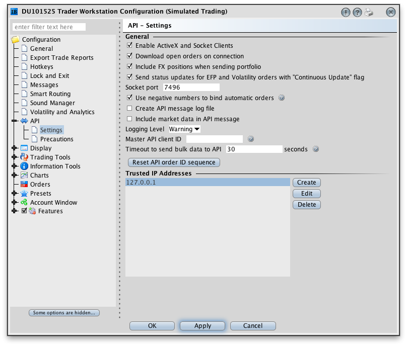

 

1.  Start JBookTrader:

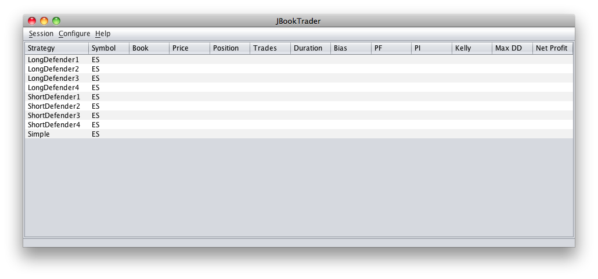

  

1.  Verify that JBookTrader can connect to TWS: right-click (control-click on Mac) on any strategy row and select Forward Test:

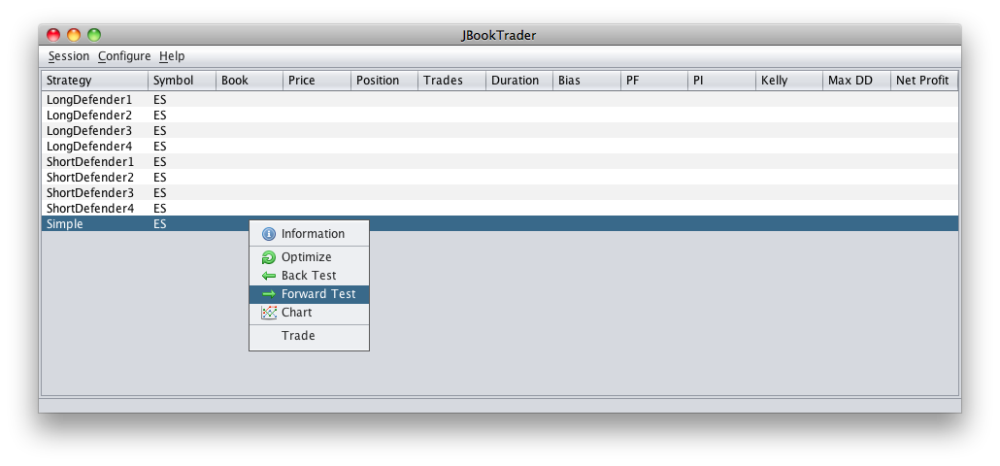

If the connection is successful and the security specified by the strategy is currently trading, you’ll see market information:

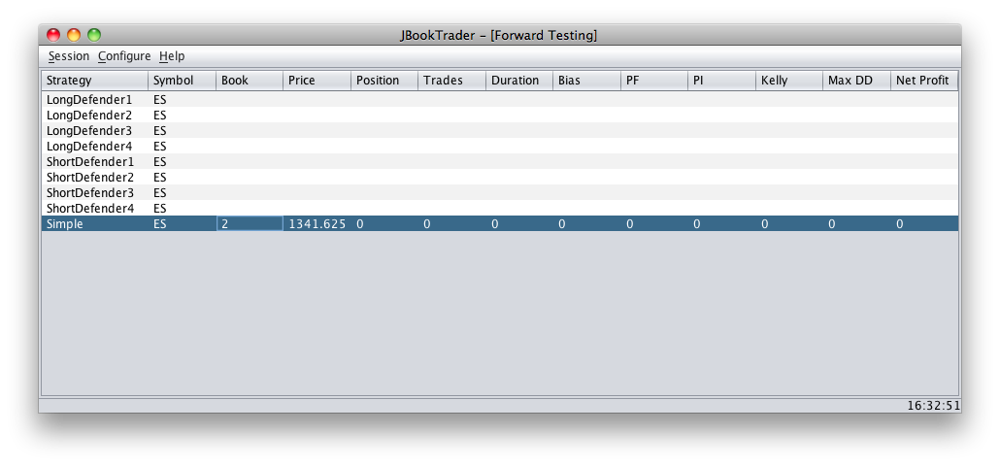

* * *

# JBookTrader Operations

Once started with the trading strategies specified, JBookTrader does not require any user actions and monitoring, or even user presence. During the trading day, JBookTrader will continuously monitor the price action for the specified securities, determine if the predefined trade entry/exit conditions have been met, place the trades, monitor their execution status, and record all events in a report file.

 

Specifically, JBookTrader will continuously execute the following sequence for each running trading strategy:

 

*   Detect when the market depth changes (any one of the 10 best bids or 10 best asks changes in either price or quantity).  For the liquid securities (such as ES and YM), this may happen several times every second.
*   Recalculate technical indicators based on the new market depth.
*   Determine if the trading strategy calls for a new position based on the new information. If new position differs from the current position, JBookTrader will place an order. For example, let us suppose that the the strategy is currently long 5 contracts. If the market moves higher and strategy determines that the profit target is reached and that the new position should be flat (i.e. 0 contracts), JBookTrader will place a MKT order to sell 5 contracts at the market.
*   The strategy will wait until the order is fully filled.
*   The transaction will be recorded in both event report and strategy report.

 

* * *

# Market Data Display

The market depth change at any point of time is reflected in the strategies table. The Market Depth column shows cumulative bid and the ask size. The Price column in JBookTrader is the midpoint between the current highest bid price and the current lowest ask price. At all times, the market data in JBookTrader is identical to that in TWS, and both applications reflect the changes almost simultaneously. Here is the TWS market depth window superimposed on JBookTrader for comparison:

 

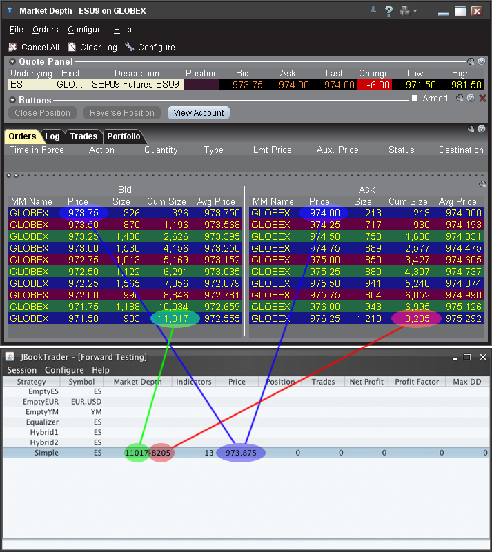

* * *

# Strategy Running Modes

JBookTrader can run any trading strategy in the following four running modes: back testing, forward testing, optimization, and trading. No changes to the strategy are required to run it in any of the running modes. Furthermore, the back testing, forward testing, and optimization modes are result-consistent. That is, if you run a strategy in the forward test mode, and then back test and optimize the same strategy over the same time period, the performance results (net profit, number of trades, profit factor, etc.) will be identical. The trading mode is approximately result-consistent with the forward testing and the back testing modes. That is because in real trading, the bid/ask spreads and the quality of executions may vary beyond the boundaries assumed by the back testing, forward testing, and optimization modes.

The running modes and their characteristics are summarized in the table below:

<table class="c46">

<tbody>

<tr class="c35">

<td class="c41" colspan="1" rowspan="1">

Running Mode

</td>

<td class="c41" colspan="1" rowspan="1">

Purpose

</td>

<td class="c41" colspan="1" rowspan="1">

TWS Connection and live market data

</td>

<td class="c41" colspan="1" rowspan="1">

Historical Data File

</td>

<td class="c41" colspan="1" rowspan="1">

Order placement and execution

</td>

</tr>

<tr class="c35">

<td class="c3" colspan="1" rowspan="1">

Back Testing

</td>

<td class="c3" colspan="1" rowspan="1">

Evaluation of historical strategy performance

</td>

<td class="c3" colspan="1" rowspan="1">

Not used

</td>

<td class="c3" colspan="1" rowspan="1">

Required

</td>

<td class="c3" colspan="1" rowspan="1">

Simulated

</td>

</tr>

<tr class="c35">

<td class="c38" colspan="1" rowspan="1">

Forward Testing

</td>

<td class="c38" colspan="1" rowspan="1">

Evaluation of real time strategy performance

</td>

<td class="c38" colspan="1" rowspan="1">

Required

</td>

<td class="c38" colspan="1" rowspan="1">

Not used

</td>

<td class="c38" colspan="1" rowspan="1">

Simulated

</td>

</tr>

<tr class="c35">

<td class="c3" colspan="1" rowspan="1">

Optimization

</td>

<td class="c3" colspan="1" rowspan="1">

Discovery and calibration of strategy parameters

</td>

<td class="c3" colspan="1" rowspan="1">

Not used

</td>

<td class="c3" colspan="1" rowspan="1">

Required

</td>

<td class="c3" colspan="1" rowspan="1">

Simulated

</td>

</tr>

<tr class="c35">

<td class="c38" colspan="1" rowspan="1">

Trading

</td>

<td class="c38" colspan="1" rowspan="1">

Live strategy trading

</td>

<td class="c38" colspan="1" rowspan="1">

Required

</td>

<td class="c38" colspan="1" rowspan="1">

Not used

</td>

<td class="c38" colspan="1" rowspan="1">

Real

</td>

</tr>

</tbody>

</table>

All four trading modes are described in detail in the sections below.

* * *

# Back Testing

Back testing is evaluating your trading strategy performance using historical market depth data. Historical data sets can be downloaded from the [Project Downloads Page](https://www.google.com/url?q=http://code.google.com/p/jbooktrader/downloads/list&sa=D&ust=1525081216087000).

To run a back test, right click on the strategy and select Back Test: 

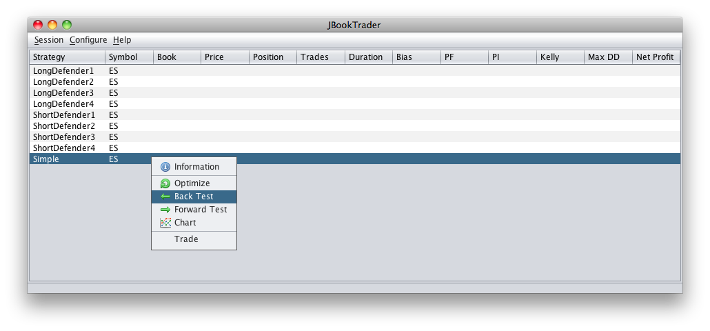

JBookTrader will pop up a file dialog. This dialog allows you to:

*   Select a historical data file
*   Optionally select a subset of the historical data file by date
*   Optionally modify the strategy parameters for the back test

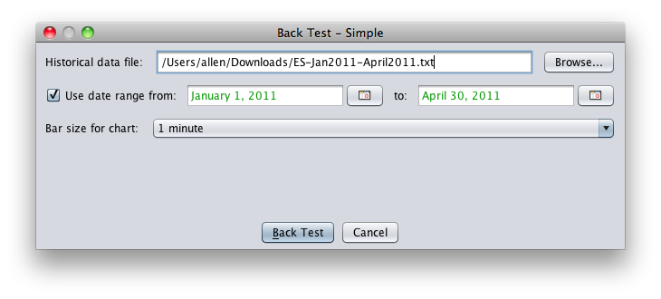

Press the "Back Test" button and JBookTrader will run the test and display the results:

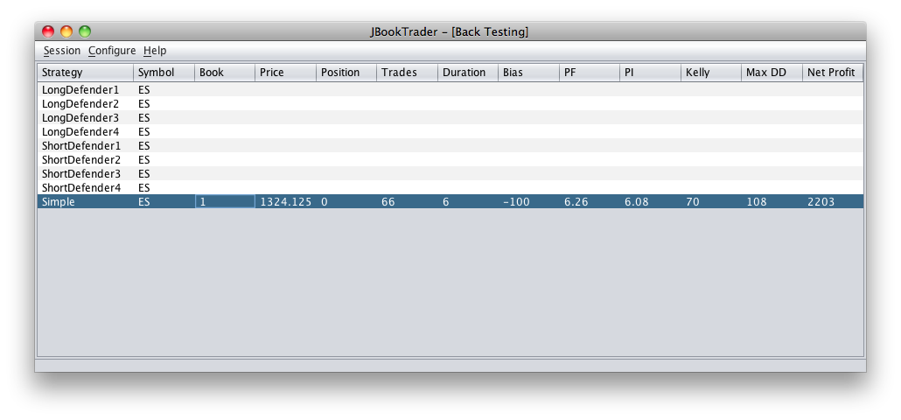

 

To see the extended back testing results, right click on the strategy and select Information:

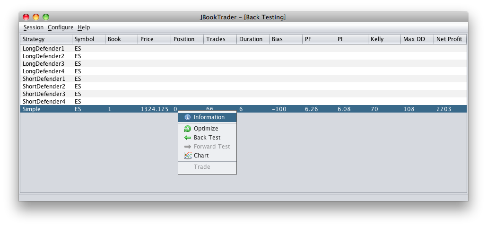

Extended back testing results will be displayed:

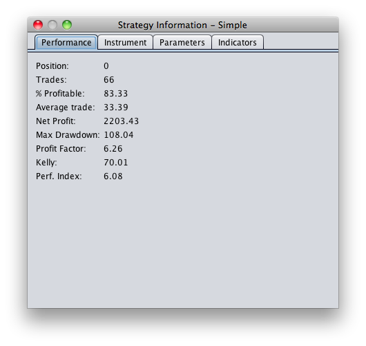

* * *

# Forward Testing

Forward testing is evaluating your trading strategy performance using live market data. In the forward testing mode, JBookTrader will connect to TWS and run the strategy, but no actual trade orders will be submitted. This makes it possible to run JBookTrader against real TWS account without making any trades. Although a paper trading account can also be used, the data feed from that type of account is unreliable.

 

To start a forward test, right click on the strategy and select Forward Test:

If the security specified by the strategy is trading, the strategy line will be updated with live market data: 

* * *

# Using simulated TWS Account

Unfortunately, the "market depth" (and similarly "market book") functionality in simulated IB account is flawed. You can frequently see crossed market (bid higher than ask), missing rows of data, and downright wrong information. The best way to see it is to start two instances of TWS, and log in to your real account in one TWS instance, and log in to your simulated account in the other TWS instance. Then bring up the "market depth" window in each one, for the same security, and compare the two windows side by side. As market depth changes, you'll see that very frequently, the data is not the same in the two windows.

 

Here is how it may look like (notice the “crossed market” and other inconsistencies in the market depth for the simulated TWS account):

 

Since market depth data is critical to JBookTrader, simulated account simply doesn't cut it.

 

The solution is to use the "Forward Test" in JBookTrader with the real TWS account. In the "Forward Test" mode, everything that happens is exactly the same as if you were actually trading, except for one thing: no orders will be transmitted to TWS. For the performance evaluation, the executions will be simulated in a manner consistent with the real executions: all buy orders will be simulated to fill at the current ask, and all sell orders will be simulated to fill at the current bid.

 

The "Forward Test" mode should also be used if your intent is to record market depth.

* * *

# Strategy Optimization

Strategy optimization is a search for a set of strategy parameters that results in the best strategy performance. JBookTrader uses multiple measures of performance. You can select a particular measure to be used in the search.

 

To start a strategy optimization, right click on the strategy and select Optimize:

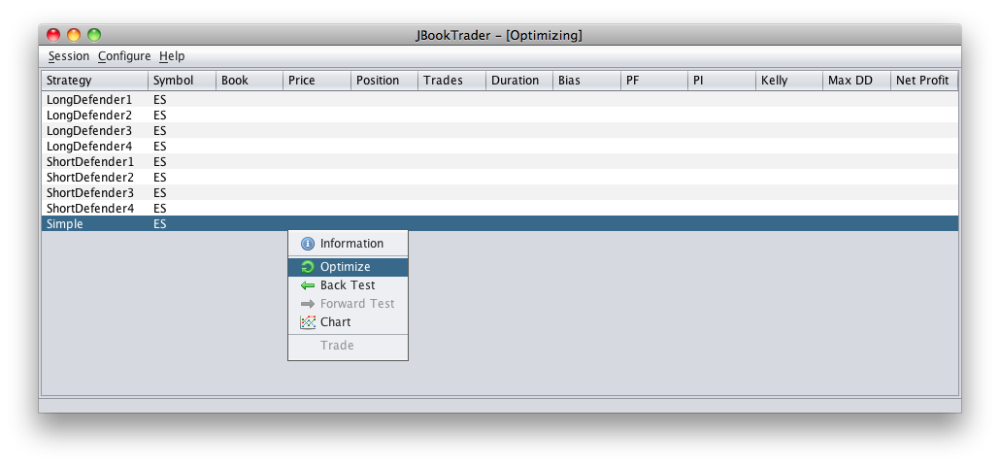

 

This will display the Strategy Optimizer dialog.  This dialog offers these options:

*   The historical data file to use
*   Optionally select a subset of the historical data by date
*   Modify the strategy parameters ranges to test
*   The optimizer method to use
*   The selection criteria
*   The minimum number of trades

These are described below.

* * *

## Optimization Options

The optimization window offers a number of configurations.  These are shown here: 

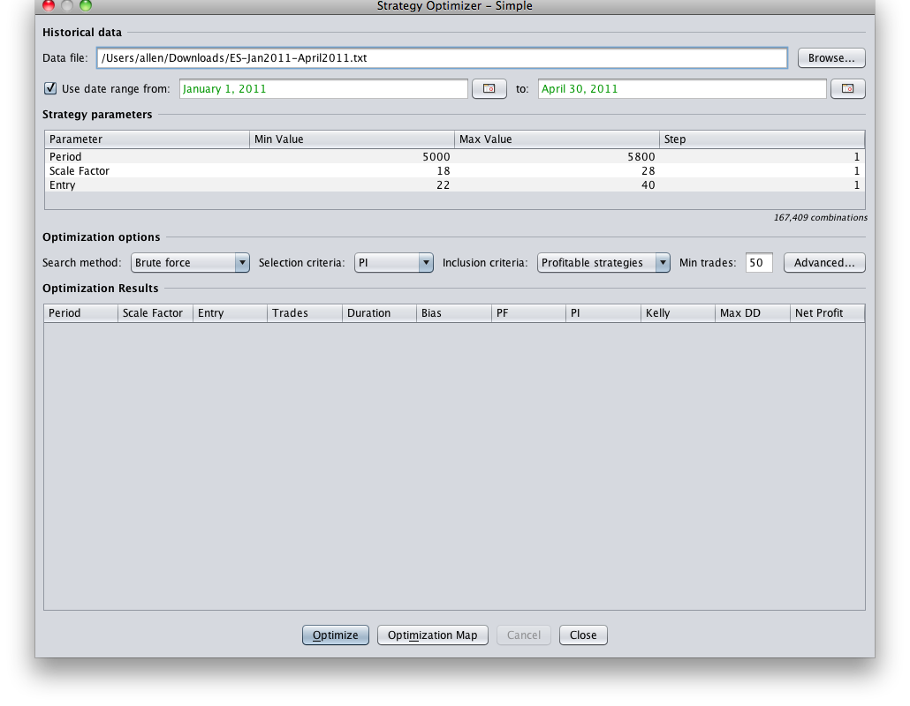

### Historical Data

Select the desired historical data file by clicking "Browse...".  To use only a subset of this data, check "Use date range" and enter the desired time period.  Note that in the example above, only data from 00:00:00 on January 1, 2011, until 23:59:59 on April 30, 2011, will be used in the optimization process.

### Search Method

There are currently two choices for the search method; "Brute Force" and "Divide & Conquer".  The simplest is Brute Force.  This method will systematically back test every possible combination of parameters to locate the highest scoring configuration based on your selection criteria and minimum number of trades.  Depending on the number of combinations of parameters, the size of the back testing data and the computing power of your computer, this method may require minutes, hours, days or even weeks to complete.

Divide & Conquer takes a speedier approach by dividing the whole set of parameters combinations into a relatively small number of groups.  The method then scores a sample of combinations from each group.  Divide and Conquer will then divide the highest scoring group into a new set of sub-groups and sample these, recursively, until it can no longer sub-divide the highest scoring group.  While this method is very quick, it isn't as thorough as the brute force method.

### Selection Criteria

There are currently four options for the selection criteria; Profit Factor, Net Profit, Kelly (Kelly Criterion) and PI (Performance Index).  Each of these choices is described in the 12. Strategy performance evaluation section of this document.

The selection here determines how the search method scores the best combination of parameters.

### Minimum Trades

The statistical relevance of the selection criteria depends greatly on the number of trades that occur over the optimization search.  The Minimum Trades field allows you to omit optimization results that produced a number of trades lower than this setting.

Once these options are set, click the Optimize button:

After completion, optimization results will be shown: 

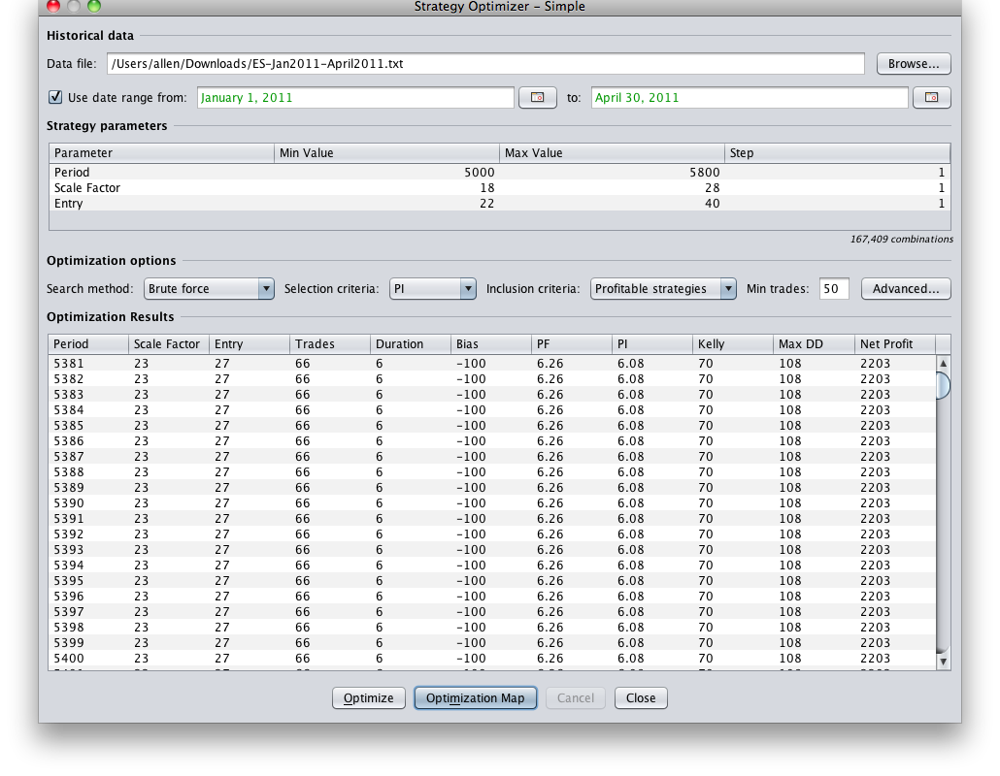

* * *

## Optimization Maps

Once an optimization has completed, it may be helpful to visualize a heat map of the parameter combinations showing the relative performance of each combination.

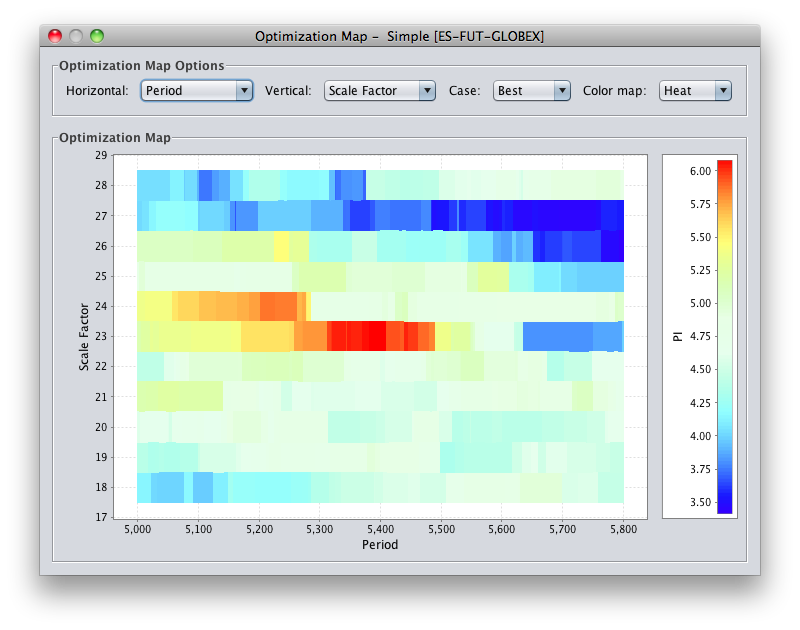

Each point in the map shows the relative performance of the combination of parameter values at that point.  In the case of the map shown above, each point represents a value combination for the Entry and Period parameters for this optimization run.  The color value represents the value of the selection criteria selected for the optimization run.

As shown in the legend along the right edge of the window, the red areas in the map have the highest profit factor and the areas in the dark blue have the lowest profit factor.

Areas in white have no result because these combinations of parameter values produced a number of trades below the Minimum trade threshold set for the optimization run, or in the case of a Divide & Conquer optimization run, because the optimizer did not test them at all. 

The map shown above represents a Brute Force optimization run.  A Divide and Conquer run of the same strategy and other settings would appear like this:

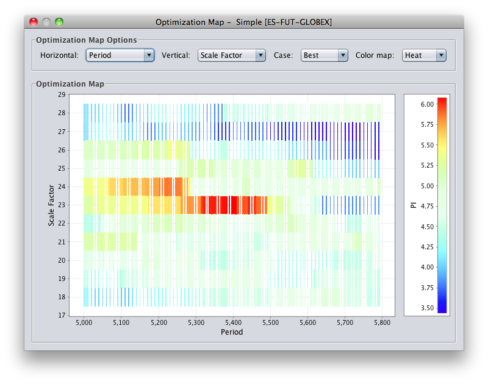

Here it is easy to see how the Divide and Conquer search method samples areas of the combination space then focuses on areas with the best relative performance.  In this case, the optimizer very sparsely tested the map except in the areas where Entry is between 10 and 13 and Period is between about 0 and 75.

If desired a user may "zoom-in" to a part of the optimization map by dragging a box with his mouse around the area of interest.

There are a number of options for the optimization map; Horizontal, Vertical, Case and Color Map.

### Horizontal

The Horizontal drop-down menu allows the selection of which parameter to map to the horizontal axis of the map.  This is more important when there are more than two parameters as the map can only show two at a time.

### Vertical

The Vertical drop-down menu allows the selection of which parameter to map to the horizontal axis of the map. This is more important when there are more than two parameters as the map can only show two at a time.

### 

Case

 The optimizer map can only show two parameters at a time.  So, when an optimized strategy uses 3 or more parameters, the resulting P&L that is mapped may vary depending on the hidden parameters.  Selecting Best will color the map with the best P&L for the shown parameters and selecting Worst will show the worst P&L for those parameters.

For example, suppose that a strategy with 3 parameters is optimized.  Let us further suppose that the P&L for some of the parameter combinations is as follows:

(10, 20, 1) : -$1,000.00

(10, 20, 2) : $12,000.00

(10, 20, 3) : -$5,000.00

If the optimization map is only displaying the first 2 parameters in the map, the color of the map for these parameters will be determined by the Case setting.  If set to Best, the map will be set to the color corresponding to $12,000.00, if Case is set to Worst, then the map will be set to the color corresponding to -$5,000.00.

### Color Map

The color map drop-down menu contains the choices; Heat and Gray.  Heat uses color to denote performance and Gray uses shades of grey to denote performance.  This might be useful if the viewer has trouble distinguishing colors or if the the map will be printed on a monotone printer or other medium.

* * *

# Strategy Performance Chart

In discretionary (manual) trading, charts are used beforea trading decision is made. Since JBookTrader is a fully automated trading system, there is no one to actually look at the chart. The system makes all decisions. However, the charts are still very useful for strategy evaluation after the period of trading.

 

To display a strategy performance chart, run any strategy in one of the three modes: Back Test, Forward Test, or Trade. Next, right-click (control-click on Mac) on the strategy and select Chart:

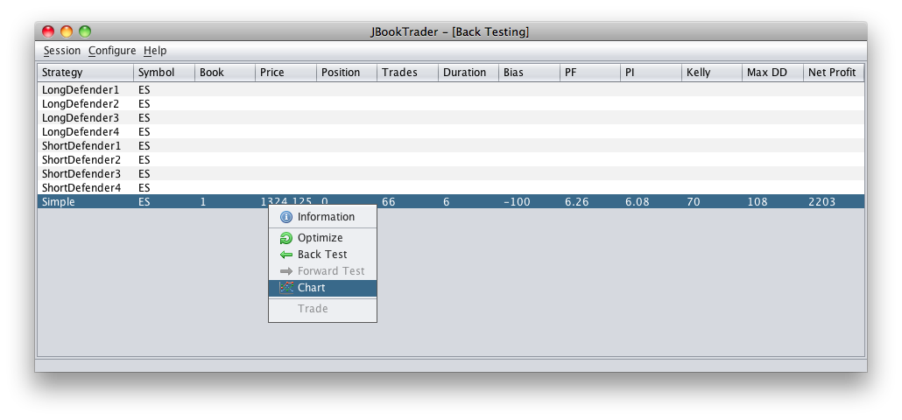

The strategy performance chart will be displayed:

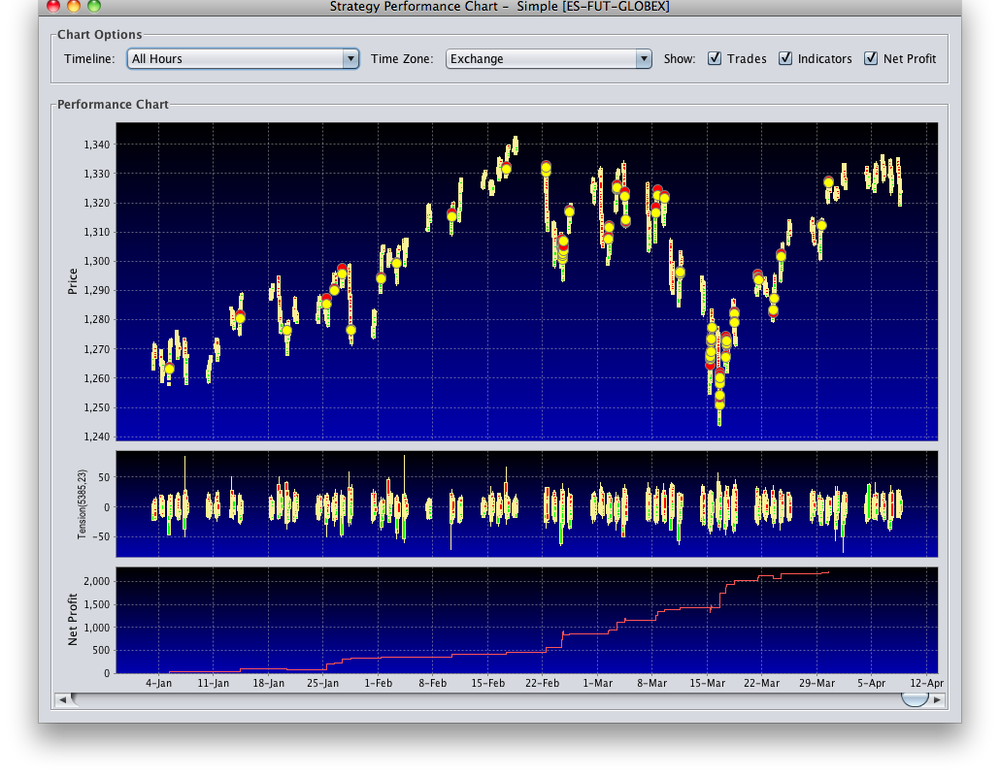

 

The performance chart contains the information about the market and the strategy, since it has started. The green circles mark the times and the prices when the strategy took long positions, the red circles mark the times and the prices when the strategy took short positions, and the yellow circles mark the times and the prices when the strategy took flat positions. The number in the circle indicates the number of contracts/shares held by the strategy.

The performance chart is zoom-able. To zoom in, left-click on the chart area and drag to the right. To zoom out, left-click on the chart area and drag to the left:

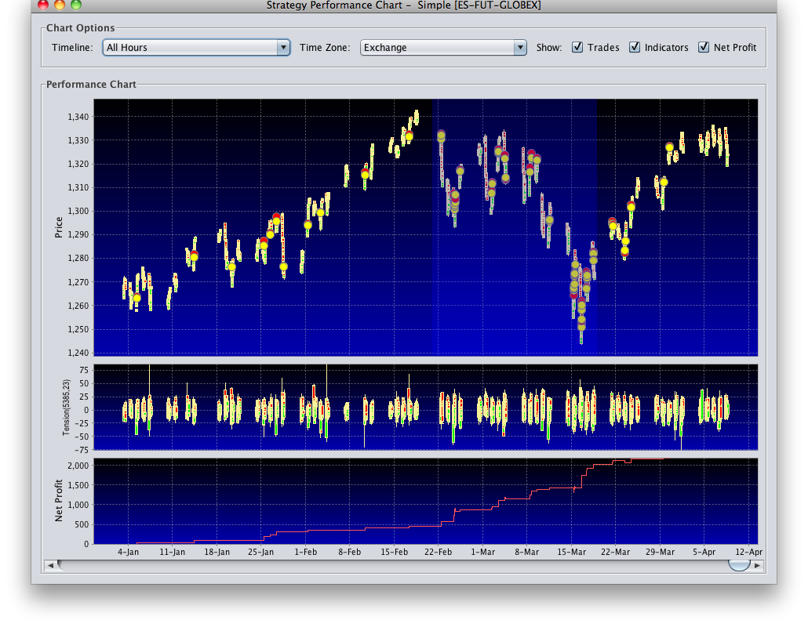

There are numerous chart display options which you can adjust. To get to the options, right-click (control-click on Mac) on the chart and choose Properties:

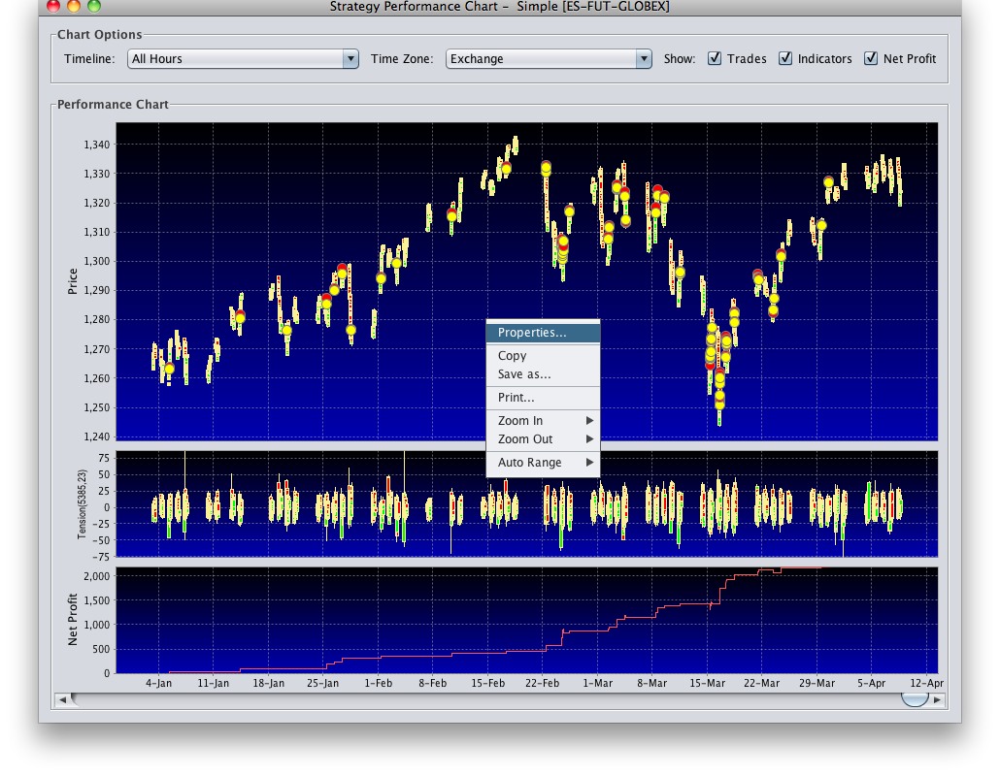

* * *

# Strategy Performance Evaluation

## Trades

This is the total number of trades that executed during the strategy’s run. The greater the number of trades (and the longer the historical data period is), the more statistically significant the performance results will be.

## Percent Profitable

Percent of profitable trades.

## Average Trade

This is the total net profit divided by the number of trades.

## Net Profit

This is the total profit or loss of the strategy’s run.

## Max DD

The Maximum Drawdown indicates the largest decline from the highest peak during the course of the strategy's run.

## Profit Factor

Profit Factor is a measure of a strategy’s performance and is measured as the ratio:

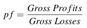

## 

Kelly

Kelly provides an indication of the maximumamount of trading capital that should be applied to the given strategy.  The result is in the range 0 - 100 and indicates the maximum percentage that should be allocated.  The Kelly Criterion is calculated with the formula:

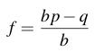

Where:

f  is the maximum fraction of the total capital to invest

b is the win-loss ratio

p is the probability of a winning trade

q is the probability of a losing trade

For more information see [http://en.wikipedia.org/wiki/Kelly_criterion](https://www.google.com/url?q=http://en.wikipedia.org/wiki/Kelly_criterion&sa=D&ust=1525081216098000).

In the trading systems domain, Kelly can be used for position sizing. It can also be used to directly compare the "goodness" of multiple strategies side by side. Let's suppose that system Ahas Kelly of 5% while system B has Kelly of 50%. Clearly, system B is superior to systemA, because its distribution of winning and losing trades allows a much greater proportion of capital to risk on every trade.

## Performance Index

The Performance Index is another measure of the Strategy’s performance.  It is calculated as 10 times the average profit per trade divided by the standard deviation of trades:

The higher the performance index is, the more "quality" the strategy has. Performance Index is closely related to System Quality Number, introduced by Van K. Tharp in his "Definitive Guide to Position Sizing".

References:

[http://www.ninjatrader-support2.com/vb/showthread.php?t=4320](https://www.google.com/url?q=http://www.ninjatrader-support2.com/vb/showthread.php?t%3D4320&sa=D&ust=1525081216099000)

[http://www.iitm.com/Definitive-Guide-to-Position-Sizing.htm](https://www.google.com/url?q=http://www.iitm.com/Definitive-Guide-to-Position-Sizing.htm&sa=D&ust=1525081216099000)

[http://groups.google.com/group/jbooktrader/browse_thread/thread/f35707d6d1e5163f](https://www.google.com/url?q=http://groups.google.com/group/jbooktrader/browse_thread/thread/f35707d6d1e5163f&sa=D&ust=1525081216100000)

* * *

# Recording Market Data

When a strategy runs in either Forward Testor Trademode, it accumulates market depth data and saves it in a file in the /marketData directory.

 

Open one of the saved files in a text editor. The market depth history is saved as a sequence of lines.  Each line represents a 1-second snapshot of the market and contains 4 columns:

 

Column  1: date in the MMddyy format

 Column  2: time in the HHmmss format

 Column  3: book balance

 Column  4: price

 

Here is how it may look:

…

 062409,081232,-11,894.375

 062409,081233,-11,894.375

 062409,081234,-11,894.375

 062409,081235,-11,894.375

 062409,081236,-11,894.375

 062409,081237,-12,894.375

 062409,081238,-13,894.375

 062409,081239,-6,894.125

 062409,081240,1,894.125

 062409,081241,2,894.125

 062409,081242,2,894.125

 062409,081243,1,894.125

 062409,081244,1,894.125

 …

The saved book may subsequently be used by any strategy for back testing and optimization purposes.

* * *

# Trading

To begin live trading of your strategy, right-click (control-click on Mac) and choose Trade from the contextual menu.

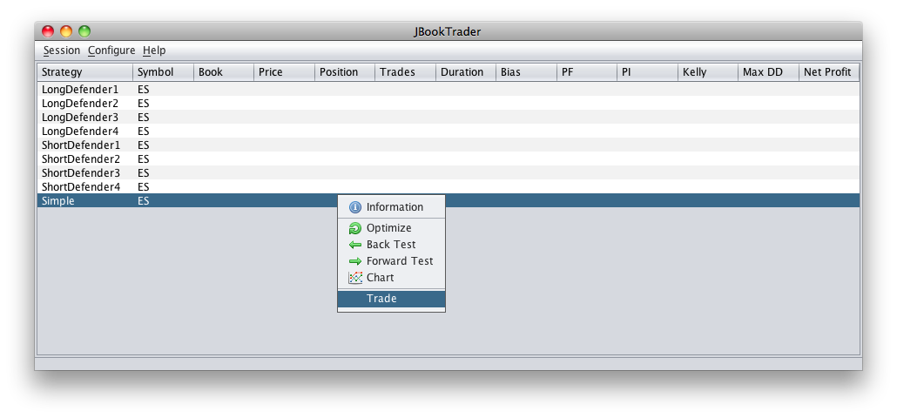

 

If JBookTrader detects that you connected to a real TWS account, it will ask for a confirmation:

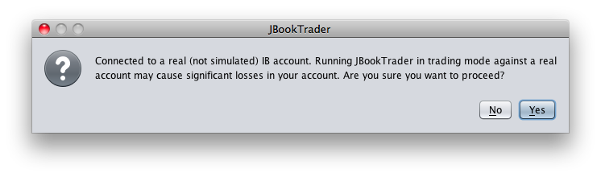

* * *

# Reporting

All major activities that JBookTrader performs during the trading day are logged into a dedicated log file in HTML format (EventLog.htm).  The event report can be used at the end of the trading day to diagnose and debug any potential problems that occurred during the day.

 

The event report typically looks like this:

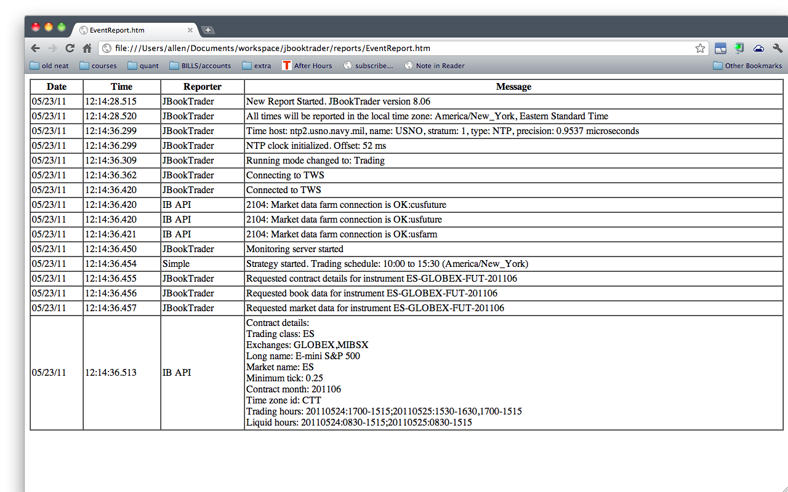

The event report will contain informational messages from TWS and execution reports. If you see anything else (such as error messages from TWS or other errors), that would indicate a problem that needs to be addressed.

 

Additionally, every strategy creates its own log file, which is named after the class where this strategy is implemented. For example, if the strategy is defined in a class MyStrategy.java, the corresponding strategy report will be named MyStrategy.htm. The strategy log can be used to evaluate the strategy performance. Although the log is in HTML format for easy viewing, you can also import it into a spreadsheet (such as MS Excel) to analyze the strategy performance during the day and to construct the charts, if needed.

 

A typical example of a strategy log:

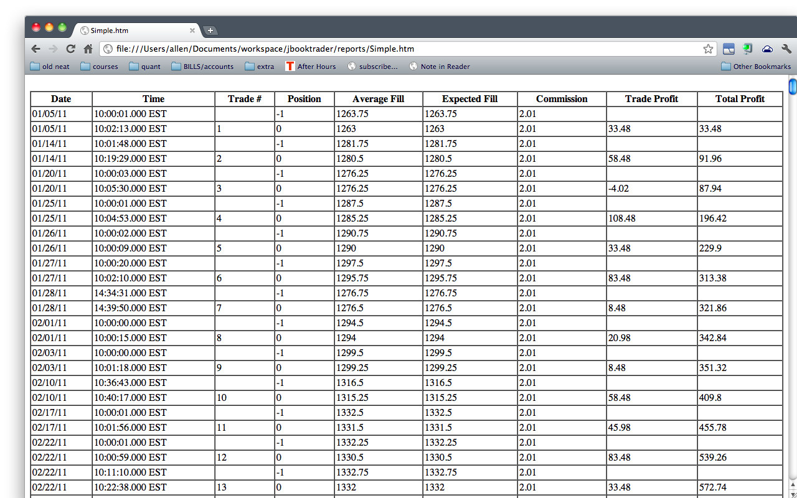

The type of information logged in either event report and, like everything else in JBookTrader,  the strategy report can be customized by the user.

 

 

* * *

# Preferences

JBookTrader user preferences are found by clicking the menu item Preferences in the Configure menu:

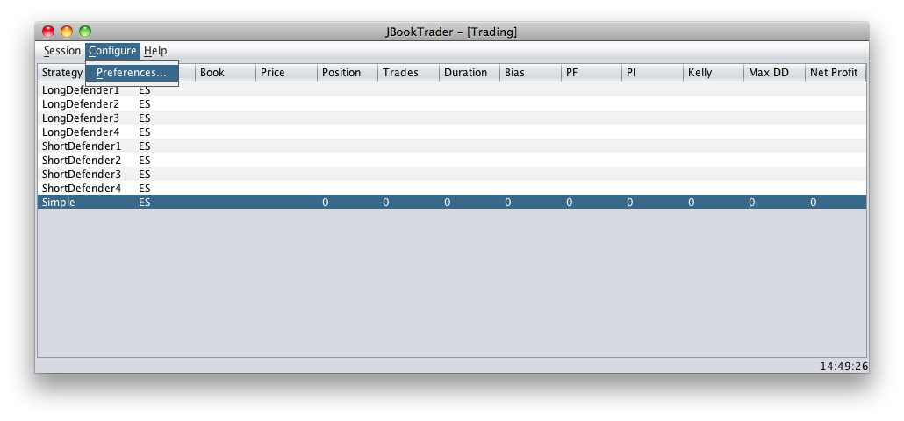

The preferences window will appear:

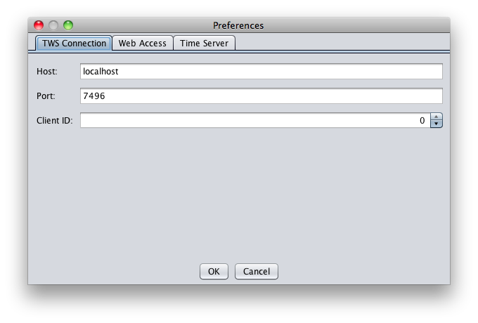

The Preferences window has three tabs:

*   TWS Connection
*   Web Access
*   Look & Feel

 

## TWS Connection

The TWS Connection tab allows configuration of the host, port and client ID that should be used when connecting to TWS. The Host preference should match the IP Address or host name of the computer running the TWS instance you which JBookTrader to connect to.  Use localhost (the default) if TWS is running on the same machine as JBookTrader. The Port preference should match the value of the socket port as set in TWS under API in the Global Configuration (see Section 4, "Running JBookTrader"). The Client ID field should be used if you have multiple JBookTrader instances accessing the same TWS instance.  Each should connect with a unique Client ID.

## Web Access

It is also possible to monitor JBookTrader via a web interface.  If enabled, JBookTrader’s in-built web server will provide basic information about a running strategy.

 

The configuration settings as they appear in the Web Access tab:

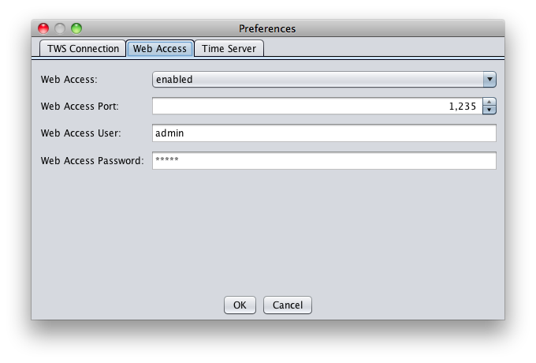

To access the report from any web browser, connect to the IP address of the computer running JBookTrader and at the port configured in the Web Access preferences.  For example, if your machine is at IP address 192.168.1.68 and you’ve configured the Web Access port to 8,080, then, from your web browser, access http://192.168.1.68:8080/ for your report. Note that web access is only available when JBookTrader is running in either "trade" or "forward test" mode.

To access your report, you'll be asked to reproduce the same credentials that were provided in the previous step.

If the authentication challenge is successful, the report will be presented in the client web browser.  Here is an example of this report:

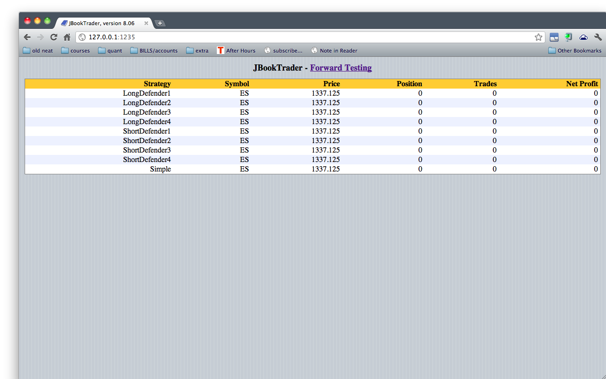

Note, in this case, only the strategies "Equalizer" and "Simple" have generated a Strategy Report yet and clicking their names will open them.

If Table Layout is set to "simple" then the output will be listed in alphabetical order without grouping by the underlying security.

If you’d like to access the report via a web browser on the same machine, simply use http://localhost:[port number]/.  If you’d like to monitor JBookTrader from any web browser anywhere on the Internet, you must ensure that your JBookTrader computer is accessible from the Internet with a known IP address or domain name.  This is beyond the scope of this document, but here are some pointers:

<table class="c46">

<tbody>

<tr class="c35">

<td class="c12" colspan="1" rowspan="1">

JBookTrader and your Browser are located...

</td>

<td class="c12" colspan="1" rowspan="1">

Addressing notes

</td>

</tr>

<tr class="c35">

<td class="c45" colspan="1" rowspan="1">

On the same machine

</td>

<td class="c45" colspan="1" rowspan="1">

On most machines, you can access Web Access with this address:

http://localhost:8080/ or

http://127.0.0.1:8080/

Assuming that you have configured the "Web access port" to 8080.  If this doesn't work for you, you may have a host-based firewall which is blocking this port.

</td>

</tr>

<tr class="c35">

<td class="c45" colspan="1" rowspan="1">

On the same local network

</td>

<td class="c45" colspan="1" rowspan="1">

This depends on your setup, but most consumer routers will assign an address from the following ranges for devices within your Local Area Network (LAN):

http://10.xxx.xxx.xxx:8080/

http://172.[16-31].xxx.xxx:8080/

http://192.168.xxx.xxx:8080/

Alternatively, you may be able to access your JBookTrader machine via its machine name as follows:

http://[machine_name].local:8080/

</td>

</tr>

<tr class="c35">

<td class="c45" colspan="1" rowspan="1">

Anywhere on the Internet

</td>

<td class="c45" colspan="1" rowspan="1">

If you have enabled Net Address Translation (NAT, sometimes called "Games & Applications" in some consumer routers), on your Internet router, you may be able to access JBookTrader from anywhere in the world, if you know your public Internet IP address.

http://[your public IP address]:[assigned NAT port]/

Alternatively, if you use DNS, you could access JBookTrader with your host name as follows:

http://[your hostname]:[assigned NAT port]/

Note that the assigned NAT port may differ from your Web access port.

</td>

</tr>

</tbody>

</table>

In most modern browsers, the page will auto-update every 5 seconds or so to show the current statistics.

Each strategy name is linked to the strategy report as shown in the Reporting section of this document.  In addition, the Event Report can be accessed by clicking the link "Event Report" at the bottom of the output.

* * *

## Look & Feel

JBookTrader supports two main types of look & feel as shown in the Look & Feel preference tab:

 

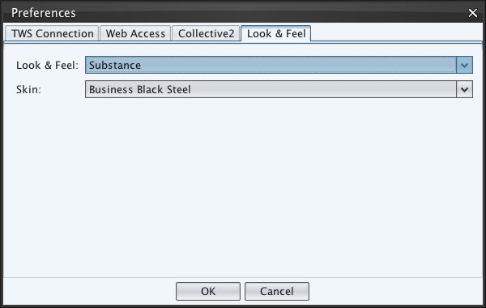

The two types are:

*   Native - the native look & feel is provided by Sun and attempts to provide an interface for JBookTrader that is natural for the operating system it is running on.  
    
*   Substance - this is a skinnable look & feel.  If this is selected, the Skin drop-menu will be active containing a number of color schemes.  Use of a Substance skin should provide a consistent look & feel across multiple running instances regardless of the operating system supporting them.

Changing the skin will take effect immediately.  Changing the Look & Feel may require a restart before the change takes effect.

* * *

# Adding your own trading strategy

* * *

# Literature

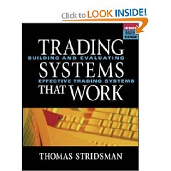

                                                                                                                                                     

# Technical Support

JBookTrader technical support is provided by the author and the users of this software in the [JBookTrader Discussion Group](https://www.google.com/url?q=http://groups.google.com/group/jbooktrader/topics&sa=D&ust=1525081216115000).

■